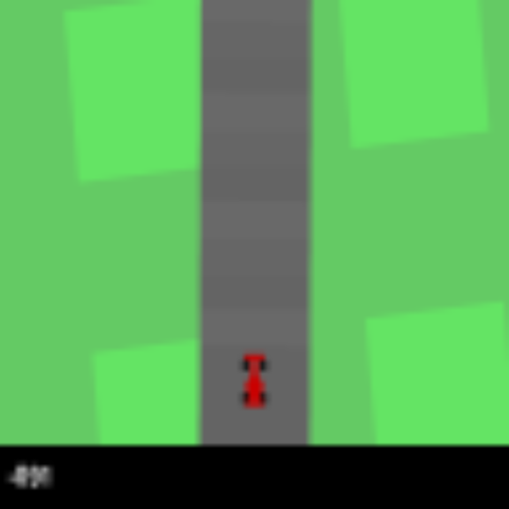
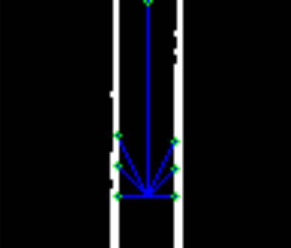

# Dokumentation

## 1. Dateistruktur

```python
working-dir/
| - .gitignore # Definition von Dateien, die nicht von git getrackt werden sollen
| - car.py # Beschreibt das Fahrzeug und enthält die gesamte Pipeline
| - env_wrapper.py # Wrapper für die Gymnasium Car Racing Simulation
| - input_controller.py # Manuelle Steuerung des Fahrzeugs
| - lane_detection.py # Modul zur Spurerkennung
| - lateral_control.py # Modul zur Querregelung
| - longitudinal_control.py # Modul zur Längsregelung
| - main.py # Hauptdatei, die die Pipeline über 5 Iterationen ausführt
| - path_planning.py # Modul zur Pfadplanung
```

## 2. Dateien

## 2.0 Datei structs_and_configs.py

Enthält Konstanten und Strukturklassen, die innerhalb des gesammten Projekts verwendet werden.

### 2.1 Datei [car.py](../src/car.py)

In der Datei car.py ist die Car-Klasse definiert, welche die Entscheidungsfindung eines autonomen
Fahrzeugs übernimmt, indem sie Sensorbeobachtungen (mittels Vektoren) verarbeitet und Fahrentscheidungen trifft.
Dabei sind unter anderem die Spurerkennung, Pfadplanung sowie Queer- und
Längsregelung, um Lenkwinkel, Beschleunigung und Bremsung zu berechnen.

### 2.2 Datei [lane_detection.py](../src/lane_detection.py)

Die Klasse LaneDetection ist für die Erkennung der Fahrspuren in Bildern
des Fahrzeugs zuständig.



Diese Methode 'detect_lanes' nimmt ein Bild als Eingabe und führt eine Vorverarbeitung durch, indem sie das Bild
beschneidet, um Teile der Anzeige zu entfernen. Anschließend wird die Kantenerkennung auf das Bild angewendet.

Es wird eine Binärisierung durchgeführt, um die Kanten hervorzuheben (image > 70).
Abschließend wird ein Bereich des Bildes maskiert, um das eigene Fahrzeug auszublenden und so die Verarbeitung
zu vereinfachen.

Für die __Evaluierung__ der verschiedenen __lane detection__ Algorithmen kann die [Lane Detection](../src/lane_detection.py) mit dem Beispielbild, das oben dargestellt ist, direkt in der Konsole gestartet werden.

### 2.2 Datei [path_planning.py](../src/path_planning.py)

Die Klasse PathPlanning ist für die Pfadplanung/-bestimmung für ein autonomes Fahrzeugsystem zuständig.



Die Methode 'sensor_application' verwendet die erkannten Fahrspuren der __LaneDetection__, um die Abstände und Richtungen Fahrspurlinien in verschiedenen Richtungen relativ zur aktuellen Position des
Fahrzeugs zu bestimmen. Dabei werden unterschiedliche Vektoren definiert, um die Umgebung des
gesamten Fahrzeugs zu erkennen.

In der Methode 'plan' wird der längste Vektor berechnet, welcher im späteren Verlauf eine entscheidende Rolle für Quer-/ und Längsregelung ist.

Die Funktion kann mit [Test Path Planning](../src/test_path_planning.py) getestet werden, allerdings ist die Visualisierung aktuell nicht korrekt.

### 2.3 Datei [lateral_control.py](../src/lateral_control.py)

In dieser Klasse wird mittels dem längsten Vektor der Winkel zwischen der
Fahrtrichtung und dem Richtungsvektor des Fahrzeugs berechnet. Dabei zeigt der längste Vektor, die Richtung in die das Fahrzeug hinfahren soll.

### 2.3 Datei [longitudinal_control.py](../src/longitudinal_control.py)

In dieser Klasse wird mittels einem PID-Regler die Längsregelung des Fahrzeuges gesteuert. Dabei wird
die Zielgeschwindigkeit unter anderem in Abhängigkeit zum aktuell längsten
erkannten Vektor berechnet.

## 3. Möglichkeiten für eine Weiterentwicklung

- [ ] [reinforcement learning](../src/reinforcement.py) fertigstellen
- [x] multithreading implementieren

## 4. Ausführung

1. In dern Ordner ../src navigieren
2. Venv umgebung starten
3. [`main.py`](../src/main.py) ausführen

Die Simulation wird sich öffnen und das Fahrzeug sich entsprechend
der Pipeline bewegen.

### 4.1 Parallele Ausführung mit Multiprocessing

[Multiprocessing](../src/main_multiprocessing.py) mit dem flag `--parallel` ausführen für parallele Auswertung.
